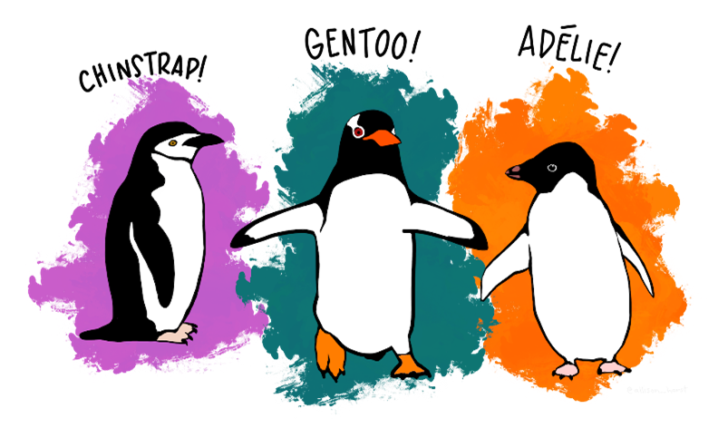

Informe Pingu Project
================

## Pingu Project

El presente proyecto es un trabajo del curso R, Quarto y GitHub de la
Escuela de doctorado de la Universidad de Alcalá (UAH).

## Datos

Los datos contienen medidas sobre tres especies diferentes de pingüinos
(Adeline, Chinstrap y Gentoo) obervadas en tres islas de la Antartida
(Biscoe, Dream y Torgersen).



Los datos fueron obtenidos del paquete “palmerpenguins”. Para ello,
primero instalamos el paquete y cargamos este paquete y “tidyverse”:

``` r
#install.packages ("palmerpenguins")
library(palmerpenguins)
library(tidyverse)
```

    ── Attaching packages ─────────────────────────────────────── tidyverse 1.3.2 ──
    ✔ ggplot2 3.4.0      ✔ purrr   0.3.5 
    ✔ tibble  3.1.8      ✔ dplyr   1.0.10
    ✔ tidyr   1.2.1      ✔ stringr 1.5.0 
    ✔ readr   2.1.3      ✔ forcats 0.5.2 
    ── Conflicts ────────────────────────────────────────── tidyverse_conflicts() ──
    ✖ dplyr::filter() masks stats::filter()
    ✖ dplyr::lag()    masks stats::lag()

Se denominó el dataset como “dt” para poder llamarlo más adelante

``` r
dt <- data.frame(penguins)
```

Realizamos una primera aproximación con los datos para ver sus
características y su distribución:

``` r
head(dt)
```

      species    island bill_length_mm bill_depth_mm flipper_length_mm body_mass_g
    1  Adelie Torgersen           39.1          18.7               181        3750
    2  Adelie Torgersen           39.5          17.4               186        3800
    3  Adelie Torgersen           40.3          18.0               195        3250
    4  Adelie Torgersen             NA            NA                NA          NA
    5  Adelie Torgersen           36.7          19.3               193        3450
    6  Adelie Torgersen           39.3          20.6               190        3650
         sex year
    1   male 2007
    2 female 2007
    3 female 2007
    4   <NA> 2007
    5 female 2007
    6   male 2007

``` r
glimpse(dt)
```

    Rows: 344
    Columns: 8
    $ species           <fct> Adelie, Adelie, Adelie, Adelie, Adelie, Adelie, Adel…
    $ island            <fct> Torgersen, Torgersen, Torgersen, Torgersen, Torgerse…
    $ bill_length_mm    <dbl> 39.1, 39.5, 40.3, NA, 36.7, 39.3, 38.9, 39.2, 34.1, …
    $ bill_depth_mm     <dbl> 18.7, 17.4, 18.0, NA, 19.3, 20.6, 17.8, 19.6, 18.1, …
    $ flipper_length_mm <int> 181, 186, 195, NA, 193, 190, 181, 195, 193, 190, 186…
    $ body_mass_g       <int> 3750, 3800, 3250, NA, 3450, 3650, 3625, 4675, 3475, …
    $ sex               <fct> male, female, female, NA, female, male, female, male…
    $ year              <int> 2007, 2007, 2007, 2007, 2007, 2007, 2007, 2007, 2007…

``` r
summary(dt)
```

          species          island    bill_length_mm  bill_depth_mm  
     Adelie   :152   Biscoe   :168   Min.   :32.10   Min.   :13.10  
     Chinstrap: 68   Dream    :124   1st Qu.:39.23   1st Qu.:15.60  
     Gentoo   :124   Torgersen: 52   Median :44.45   Median :17.30  
                                     Mean   :43.92   Mean   :17.15  
                                     3rd Qu.:48.50   3rd Qu.:18.70  
                                     Max.   :59.60   Max.   :21.50  
                                     NA's   :2       NA's   :2      
     flipper_length_mm  body_mass_g       sex           year     
     Min.   :172.0     Min.   :2700   female:165   Min.   :2007  
     1st Qu.:190.0     1st Qu.:3550   male  :168   1st Qu.:2007  
     Median :197.0     Median :4050   NA's  : 11   Median :2008  
     Mean   :200.9     Mean   :4202                Mean   :2008  
     3rd Qu.:213.0     3rd Qu.:4750                3rd Qu.:2009  
     Max.   :231.0     Max.   :6300                Max.   :2009  
     NA's   :2         NA's   :2                                 

\#Descriptivos

Observamos la distribución de los datos calculando el número de
individuos totales, maculinos y femeninos por especie:

``` r
table(dt$species)
```


       Adelie Chinstrap    Gentoo 
          152        68       124 

``` r
table(dt$species, dt$sex)
```

               
                female male
      Adelie        73   73
      Chinstrap     34   34
      Gentoo        58   61

También vimos la media, desviación estándar, valor mínimo y máximo de la
longitud y profundidad del pico, la longitud de la aleta y el tamaño:

``` r
##Longitud pico
#result_lenght <- dt %>% summarise(mean(bill_length_mm, na.rm = T), sd(bill_length_mm, na.rm = T), max(bill_length_mm, na.rm = T), min(bill_length_mm, na.rm = T))
#result_lenght

##Profundidad pico
#result_depht <- dt %>% summarise(mean(bill_depth_mm, na.rm = T), sd(bill_depth_mm, na.rm = T), max(bill_depth_mm, na.rm = T), min(bill_depth_mm, na.rm = T))
#result_depht

##Longitud de la aleta
#result_flipper <- dt %>% summarise(mean(flipper_length_mm, na.rm = T), sd(flipper_length_mm, na.rm = T), max(flipper_length_mm, na.rm = T), min(flipper_length_mm, na.rm = T))
#result_flipper

##Tamaño
#result_bodymass <- dt %>% summarise(mean(body_mass_g, na.rm = T), sd(body_mass_g, na.rm = T), max(body_mass_g, na.rm = T), min(body_mass_g, na.rm = T))
#result_bodymass
```

| Variable         |  mean   |   sd   | min  | max  |
|------------------|:-------:|:------:|:----:|:----:|
| Longitud pico    |  43.92  |  5.46  | 32.1 | 59.6 |
| Profundidad pico |  17.15  |  1.97  | 13.1 | 21.5 |
| Longitud aleta   | 200.92  | 14.06  | 172  | 231  |
| Tamaño           | 4201.75 | 801.95 | 2700 | 6300 |

Para tener mayor información se vieron las anteriores medidas según sexo
de los pingüinos:

``` r
#Longitud pico
result_lenght_sex <- dt %>% filter(!is.na(sex)) %>%  group_by(sex ) %>%  summarise(mean(bill_length_mm, na.rm = T), sd(bill_length_mm, na.rm = T), max(bill_length_mm, na.rm = T), min(bill_length_mm, na.rm = T))
result_lenght_sex
```

    # A tibble: 2 × 5
      sex    `mean(bill_length_mm, na.rm = T)` sd(bill_length_mm, …¹ max(b…² min(b…³
      <fct>                              <dbl>                 <dbl>   <dbl>   <dbl>
    1 female                              42.1                  4.90    58      32.1
    2 male                                45.9                  5.37    59.6    34.6
    # … with abbreviated variable names ¹​`sd(bill_length_mm, na.rm = T)`,
    #   ²​`max(bill_length_mm, na.rm = T)`, ³​`min(bill_length_mm, na.rm = T)`

``` r
#Profundidad pico
result_depht_sex <- dt %>%  filter(!is.na(sex)) %>%  group_by(sex ) %>% summarise(mean(bill_depth_mm, na.rm = T), sd(bill_depth_mm, na.rm = T), max(bill_depth_mm, na.rm = T), min(bill_depth_mm, na.rm = T))
result_depht_sex
```

    # A tibble: 2 × 5
      sex    `mean(bill_depth_mm, na.rm = T)` sd(bill_depth_mm, na…¹ max(b…² min(b…³
      <fct>                             <dbl>                  <dbl>   <dbl>   <dbl>
    1 female                             16.4                   1.80    20.7    13.1
    2 male                               17.9                   1.86    21.5    14.1
    # … with abbreviated variable names ¹​`sd(bill_depth_mm, na.rm = T)`,
    #   ²​`max(bill_depth_mm, na.rm = T)`, ³​`min(bill_depth_mm, na.rm = T)`

``` r
#Longitud aleta
result_flipper_sex <- dt %>%  filter(!is.na(sex)) %>%  group_by(sex ) %>% summarise(mean(flipper_length_mm, na.rm = T), sd(flipper_length_mm, na.rm = T), max(flipper_length_mm, na.rm = T), min(flipper_length_mm, na.rm = T))

result_flipper_sex
```

    # A tibble: 2 × 5
      sex    `mean(flipper_length_mm, na.rm = T)` sd(flipper_lengt…¹ max(f…² min(f…³
      <fct>                                 <dbl>              <dbl>   <int>   <int>
    1 female                                 197.               12.5     222     172
    2 male                                   205.               14.5     231     178
    # … with abbreviated variable names ¹​`sd(flipper_length_mm, na.rm = T)`,
    #   ²​`max(flipper_length_mm, na.rm = T)`, ³​`min(flipper_length_mm, na.rm = T)`

``` r
#Tamaño
result_bodymass_sex <- dt %>% filter(!is.na(sex)) %>%  group_by(sex ) %>%  summarise(mean(body_mass_g, na.rm = T), sd(body_mass_g, na.rm = T), max(body_mass_g, na.rm = T), min(body_mass_g, na.rm = T))

result_bodymass_sex
```

    # A tibble: 2 × 5
      sex    `mean(body_mass_g, na.rm = T)` sd(body_mass_g, na.rm …¹ max(b…² min(b…³
      <fct>                           <dbl>                    <dbl>   <int>   <int>
    1 female                          3862.                     666.    5200    2700
    2 male                            4546.                     788.    6300    3250
    # … with abbreviated variable names ¹​`sd(body_mass_g, na.rm = T)`,
    #   ²​`max(body_mass_g, na.rm = T)`, ³​`min(body_mass_g, na.rm = T)`

Realizamos una representación gráfica del número de indivduos
muestreados de cada especie en cada isla:

``` r
ggplot(data = dt, aes( x = as.character(island), fill = species)) +
  geom_bar() + scale_fill_manual(values =  c("orange", "purple", "blue")) +
  labs(x ="Islands", y = "Number of individuals") +
  theme_classic()
```


La gráfica de barras nos permite saber que la especie “Adelie” se ha
muestreado en las tres islas. Para conocer el número de individuos
muestreados en la isla de Dream, la gráfica nos indica que se encuentra
entre los 100 y 150 individuos, para ser más exactos realizamos una
tabla del número total de individuos en cada isla:

``` r
table(dt$island)
```


       Biscoe     Dream Torgersen 
          168       124        52 

Posteriormente, creamos una gráfica para conocer el tamaño de cada
especie según el sexo:

``` r
ggplot(data= subset(dt, !is.na(sex))) + geom_boxplot(aes(x =sex, y = body_mass_g)) + facet_wrap(~species) + labs(x ="Sex", y = "Body mass (gr)") + theme_classic()
```


En esta gráfica podemos visualizar que la especie “Genteoo” tiene mayor
tamaño que las otras dos especies. Sin embargo, en la especie
“Chinstrap” el tamaño de las hembras y machos son similares.

\#Suplemento

Como complemento de la actividad decicimos analizar si había algún tipo
de relación entre el tamaño de la aleta y el tamaño del pingüino. Para
ello creamos la siguiente gráfica:

``` r
ggplot(dt, aes(x= flipper_length_mm, y = body_mass_g))+ geom_jitter() + labs(x ="Longitud aleta", y = "Tamaño pingüino (gr)") + geom_smooth(method =  lm) + theme_classic()
```

    `geom_smooth()` using formula = 'y ~ x'

    Warning: Removed 2 rows containing non-finite values (`stat_smooth()`).

    Warning: Removed 2 rows containing missing values (`geom_point()`).


\#Bibliografía

``` r
knitr::write_bib(c("tidyverse", "palmerpenguins"), file = "bibliografia.bib")
```
